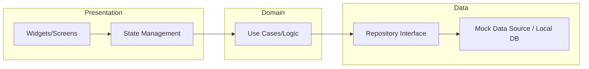

# Flutter Distribution Pro - Showcase 🚀

A professional, feature-rich Van Distribution and Sales Management application built with **Flutter**. This repository serves as a **Public Demo** of a fully operational production system, designed to solve the "last-mile" distribution challenge.

## 📈 Business Use Case
This application is built to bridge the gap between warehouses and retail points. By digitizing the van distribution process, it reduces paperwork by 100%, prevents stock discrepancies through real-time van inventory tracking, and ensures sales agents have all client history at their fingertips without needing a constant 4G connection.

## 📱 App Highlights
- **Offline-First Architecture**: Designed to support field operations in low-connectivity areas with local data persistence and robust synchronization logic.
- **Dynamic Commission Engine**: Integrated logic for real-time calculation of seller benefits, discounts, and performance incentives based on sales volume—a critical business requirement for distribution teams.
- **Sales Management**: Full lifecycle of sales, collections (reglements), and financial tracking.
- **CRM & Client Tracking**: Comprehensive client management with GPS location support.
- **Stock Management**: Inventory control with high-performance XML/CSV processing for batch updates.
- **Enterprise Reporting**: Built-in PDF generation and Bluetooth thermal printing for immediate on-site invoicing.

## 🖼️ Screenshots

  
  
  

  
  
  

## 🛠️ Architectural Overview

The project is designed using a clean, modular pattern ensuring enterprise-grade separation of concerns:

- **Features**: Each module (auth, sales, clients) is self-contained with its own UI components and business logic.
- **Data Layer**: Centralized data access layer with repository patterns, optimized for local caching (SQLite/Sqflite).
- **State Management**: Built using structured `StatefulWidget` patterns for high performance and predictability across complex forms.

## 🔑 Demo Mode Instructions

This version is pre-configured for immediate exploration:
1. **Activation**: Use key `DEMO-PRO-2026-V1`.
2. **Login**: 
   - **Username**: `admin`
   - **Password**: `123`

## 🚀 Getting Started

1. Clone the repository: `git clone <repo-url>`
2. Install dependencies: `flutter pub get`
3. Run the app: `flutter run`

## 🧰 Tech Stack
- **Framework**: Flutter (Dart)
- **Local Persistence**: Structured for **SQLite / Sqflite** (Mocked for this showcase version).
- **Data Parsing**: High-performance XML & CSV processing for inventory management.
- **Hardware Integration**: Low-level **Bluetooth communication** for thermal printing.
- **PDF Engine**: `pdf` / `printing` for dynamic document generation.
- **State Layer**: `shared_preferences` for session and configuration persistence.

---
*Developed by Moundhir Bachene - Professional Showcase Version*

