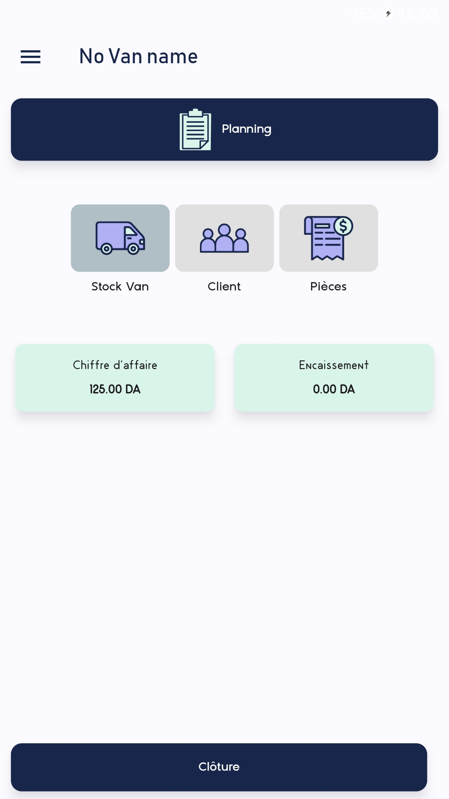
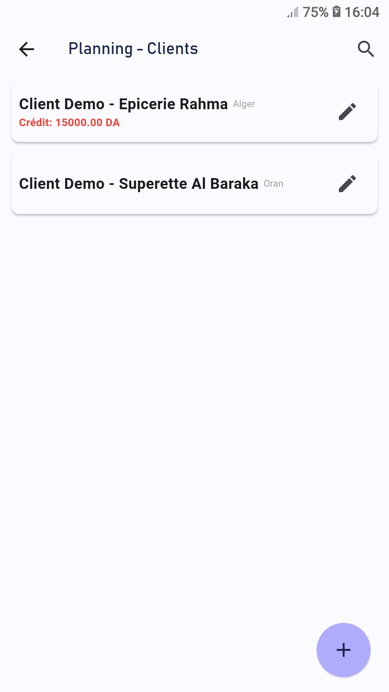
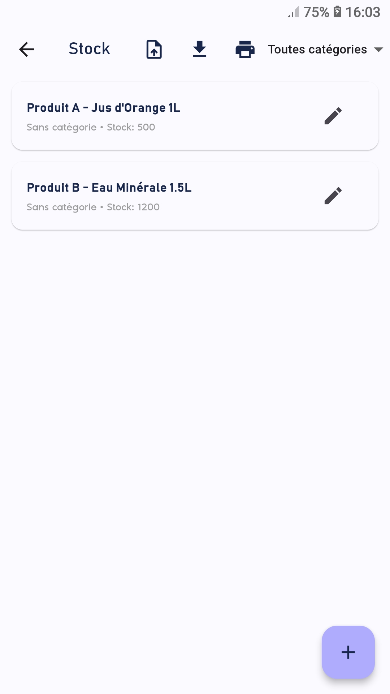
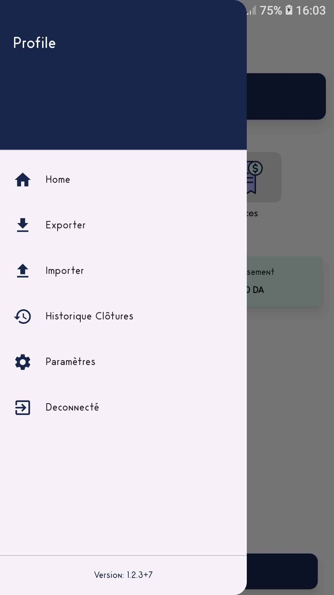
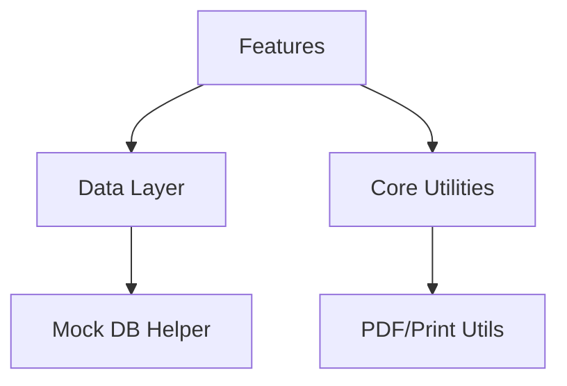

# Flutter Distribution Pro - Showcase 🚀

A professional, feature-rich Van Distribution and Sales Management application built with **Flutter**. This repository serves as a **Public Demo** of a fully operational production system, specifically prepared to showcase the app's architectural quality and core features in a standalone environment.

## 📱 App Highlights
- **Clean Architecture**: Built with a feature-based layered structure for maximum maintainability and scalability.
- **Sales Management**: Full lifecycle of sales, collections (reglements), and financial tracking.
- **CRM & Client Tracking**: Comprehensive client management with GPS location support.
- **Stock Management**: Inventory control with XML/CSV import/export capabilities.
- **Enterprise Reporting**: Built-in PDF generation and Bluetooth thermal printing for receipts.
- **Privacy by Design**: All records in this demo are generated from a controlled mock environment to ensure data privacy while maintaining full functional integrity.

## 🖼️ Screenshots

  
  
  

  
  
  

## 🛠️ Architectural Overview

The project is designed using a modular pattern, ensuring clear separation of concerns:

- **Features**: Each module (auth, sales, clients) is self-contained with its own UI and logic.
- **Data Layer**: A centralized data access layer provides a stable interface for business logic.
- **Core Utilities**: Shared constants, themes, and robust printing/PDF engines.

## 🔑 Demo Mode Instructions

This version is pre-configured for immediate exploration:
1. **Activation**: Use key `DEMO-PRO-2026-V1`.
2. **Login**: 
   - **Username**: `admin`
   - **Password**: `123`

## 🚀 Getting Started

1. Clone the repository: `git clone <repo-url>`
2. Install dependencies: `flutter pub get`
3. Run the app: `flutter run`

## 🧰 Tech Stack
- **Framework**: Flutter (Dart)
- **State Management**: StatefulWidgets / SharedPreferences
- **Storage**: Sanitized Data Layer
- **Printing**: `blue_thermal_printer` (Bluetooth)
- **PDF**: `pdf` / `printing`
- **Pickers**: `file_picker` / `csv`

---
*Developed by [USER'S NAME] - Professional Showcase Version*

